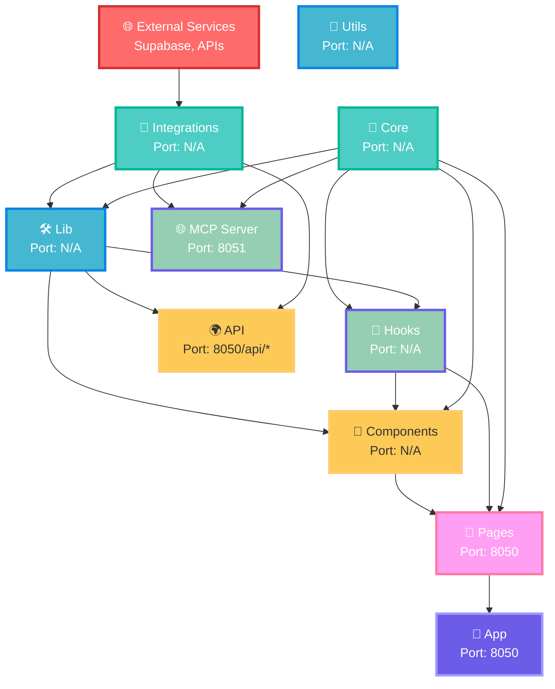
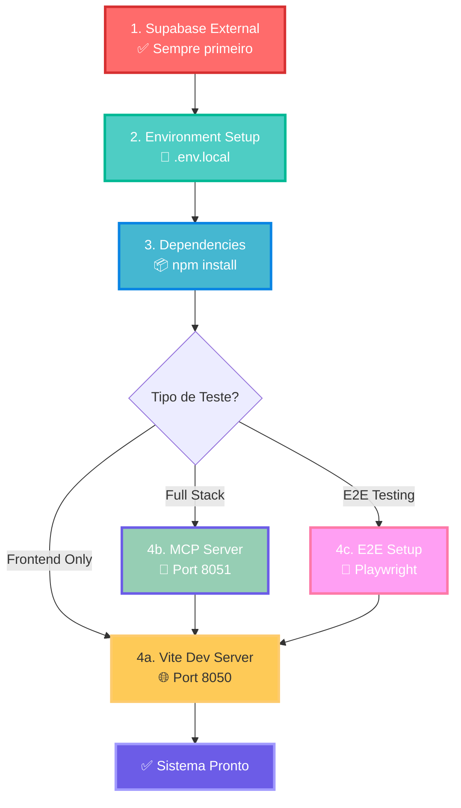
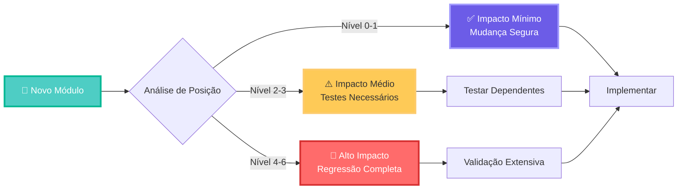
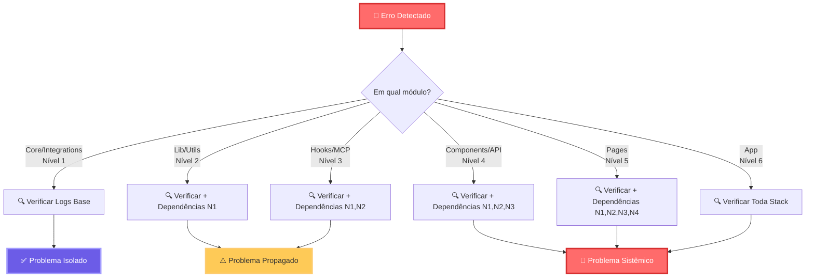
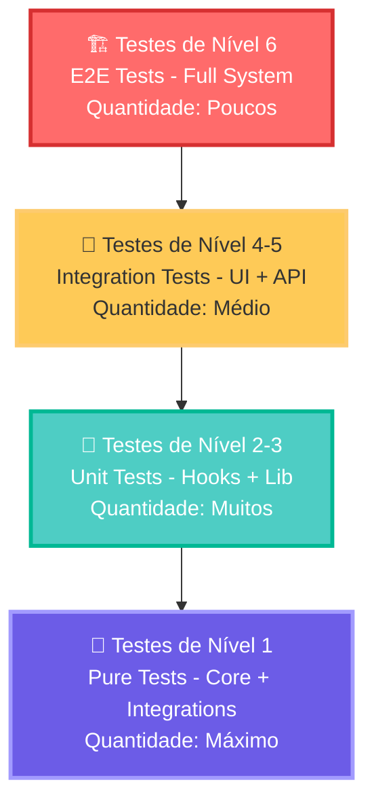

# 🏗️ Guia de Arquitetura Modular - Elite Barber SaaS

## 📋 Visão Geral da Modularização

O sistema Elite Barber foi desenvolvido com uma arquitetura modular robusta que separa claramente as responsabilidades e permite escalabilidade, manutenibilidade e reutilização de código. A estrutura foi pensada para suportar múltiplas plataformas (Web, Mobile, Desktop) com o mínimo de reescrita de código.

## 🏛️ Estrutura de Módulos

### 1. 🧠 Core Module (`src/core/`)
**Responsabilidade**: Lógica de negócio agnóstica de plataforma

```
src/core/
├── business-logic.ts    # Regras de negócio puras (sem dependências de UI)
├── data-layer.ts        # Padrões de acesso a dados abstratos
├── types.ts             # Definições de tipos cross-platform
├── constants.ts         # Constantes mobile-first e breakpoints
├── utils.ts             # Funções utilitárias agnósticas de plataforma
└── index.ts             # Exportações do módulo core
```

**Características:**
- 🚫 Sem dependências de UI ou framework
- ✅ 100% reutilizável para React Native
- 🧪 Totalmente testável de forma isolada
- 📱 Mobile-first por design

### 2. 🌐 MCP Server Module (`src/mcp/`)
**Responsabilidade**: Protocolo de comunicação externa (Model Context Protocol)

```
src/mcp/
└── server.ts            # Servidor MCP com ferramentas de integração
```

**Funcionalidades:**
- 📊 `get_appointments` - Buscar agendamentos
- 👥 `get_clients` - Gerenciar clientes  
- 💰 `get_financial_data` - Dados financeiros
- ⚙️ `get_services` - Listar serviços
- 🚀 `deploy_status` - Status do sistema

### 3. 🎨 Components Module (`src/components/`)
**Responsabilidade**: Componentes de interface reutilizáveis

```
src/components/
├── mobile-first/        # Componentes otimizados para touch
├── ui/                  # Base shadcn/ui components
├── layout/              # Componentes de layout
├── reactbits/           # Componentes específicos do projeto
├── ClientManagement.tsx # Gestão de clientes
├── FinancialDashboard.tsx # Dashboard financeiro
└── ProtectedRoute.tsx   # Roteamento protegido
```

### 4. 📄 Pages Module (`src/pages/`)
**Responsabilidade**: Páginas e fluxos de usuário

```
src/pages/
├── Index.tsx            # Página inicial
├── Booking.tsx          # Sistema de agendamento
├── Admin.tsx            # Painel administrativo
├── AdminLogin.tsx       # Login admin
├── BarbershopDashboard.tsx # Dashboard da barbearia
├── BarbershopLogin.tsx  # Login barbearia
├── BarbershopSignup.tsx # Cadastro barbearia
├── UserDashboard.tsx    # Dashboard do usuário
├── UserLogin.tsx        # Login usuário
└── NotFound.tsx         # Página 404
```

### 5. 🔗 Integrations Module (`src/integrations/`)
**Responsabilidade**: Integrações com serviços externos

```
src/integrations/
└── supabase/            # Integração com Supabase
```

### 6. 🛠️ Lib Module (`src/lib/`)
**Responsabilidade**: Bibliotecas e configurações

```
src/lib/
├── supabase.ts          # Cliente e tipos Supabase
├── database.ts          # Operações de banco
├── localStorage.ts      # Gestão de storage local
└── utils.ts             # Utilitários específicos da lib
```

### 7. 🎣 Hooks Module (`src/hooks/`)
**Responsabilidade**: Custom hooks React

```
src/hooks/
├── useAuth.tsx          # Gestão de autenticação
├── use-mobile.tsx       # Detecção mobile
└── use-toast.ts         # Sistema de notificações
```

### 8. 🌍 API Module (`api/`)
**Responsabilidade**: Endpoints serverless

```
api/
├── keep-alive.js        # Keep-alive para Supabase
└── mcp.js               # Endpoint MCP simples
```

### 9. 🧪 Testing Module
**Responsabilidade**: Testes automatizados

```
├── mcp-autonomous-test-protocol.js  # Protocolo de testes E2E autônomo
├── playwright.config.ts             # Configuração Playwright
└── tests/                           # Testes E2E
```

## 🔄 Comunicação Entre Módulos

### 1. **Core → Components**
```typescript
// Core fornece lógica de negócio para componentes
import { BusinessLogic } from '@/core';

const { isValid, errors } = BusinessLogic.Auth.validateLoginCredentials(email, password);
```

### 2. **Components → Hooks**
```typescript
// Componentes usam hooks para estado e lógica
import { useAuth } from '@/hooks/useAuth';

const { user, login, logout } = useAuth();
```

### 3. **Hooks → Lib**
```typescript
// Hooks utilizam bibliotecas para operações
import { supabase } from '@/lib/supabase';

const { data, error } = await supabase.auth.signIn({ email, password });
```

### 4. **Lib → Integrations**
```typescript
// Lib utiliza integrações para comunicação externa
import { supabase } from '@/integrations/supabase';
```

### 5. **MCP Server → Core**
```typescript
// MCP Server expõe funcionalidades do core
import { BusinessLogic } from '@/core';

const report = BusinessLogic.Financial.generateFinancialReport(payments, startDate, endDate);
```

### 6. **Pages → All Modules**
```typescript
// Pages orquestram todos os módulos
import { BusinessLogic } from '@/core';
import { useAuth } from '@/hooks/useAuth';
import { ClientManagement } from '@/components/ClientManagement';
```

## 📡 Fluxo de Dados e Teoria dos Grafos

### 🎯 Grafo de Dependências (DAG - Directed Acyclic Graph)

O sistema segue uma estrutura de **Grafo Acíclico Direcionado (DAG)** onde cada módulo tem dependências claras e não há dependências circulares. Isso garante:
- ✅ **Ordem de inicialização determinística**
- ✅ **Testes isolados por camada**
- ✅ **Debugging sistemático**
- ✅ **Deploy incremental**



### 🔄 Matriz de Dependências

| Módulo | Core | Integrations | Lib | Hooks | Components | Pages | MCP | API |
|--------|------|--------------|-----|-------|------------|-------|-----|-----|
| **Core** | - | ❌ | ❌ | ❌ | ❌ | ❌ | ❌ | ❌ |
| **Integrations** | ❌ | - | ❌ | ❌ | ❌ | ❌ | ❌ | ❌ |
| **Lib** | ✅ | ✅ | - | ❌ | ❌ | ❌ | ❌ | ❌ |
| **Hooks** | ✅ | ✅ | ✅ | - | ❌ | ❌ | ❌ | ❌ |
| **Components** | ✅ | ❌ | ✅ | ✅ | - | ❌ | ❌ | ❌ |
| **Pages** | ✅ | ❌ | ✅ | ✅ | ✅ | - | ❌ | ❌ |
| **MCP** | ✅ | ✅ | ✅ | ❌ | ❌ | ❌ | - | ❌ |
| **API** | ❌ | ✅ | ✅ | ❌ | ❌ | ❌ | ✅ | - |

**Legenda**: ✅ Depende diretamente | ❌ Não depende

### 🎲 Algoritmo de Ordenação Topológica

Para execução e testes corretos, siga esta ordem baseada no **algoritmo de Kahn**:

```
Nível 0: External Services (Supabase)
    ↓
Nível 1: Core + Integrations (independentes)
    ↓  
Nível 2: Lib + Utils (dependem de 1)
    ↓
Nível 3: Hooks + MCP Server (dependem de 1+2)
    ↓
Nível 4: Components + API (dependem de 1+2+3)
    ↓
Nível 5: Pages (dependem de 1+2+3+4)
    ↓
Nível 6: App (depende de 1+2+3+4+5)
```

## 🚀 Setup para Desenvolvimento Local

### 🎯 Sequência de Inicialização para Testes

Baseado na teoria dos grafos, siga esta sequência **obrigatória** para execução local correta:

#### 📊 Grafo de Inicialização de Serviços



### 🎚️ Cenários de Teste por Módulo

#### 📋 Matriz de Dependências de Startup

| Módulo Testado | Supabase | Frontend:8050 | MCP:8051 | Scripts Necessários |
|----------------|----------|---------------|----------|---------------------|
| **Core** | ❌ | ❌ | ❌ | `npm test:core` |
| **Integrations** | ✅ | ❌ | ❌ | `npm test:integrations` |
| **Lib** | ✅ | ❌ | ❌ | `npm test:lib` |
| **Hooks** | ✅ | ✅ | ❌ | `npm run dev` |
| **Components** | ✅ | ✅ | ❌ | `npm run dev` |
| **Pages** | ✅ | ✅ | ❌ | `npm run dev` |
| **MCP Server** | ✅ | ✅ | ✅ | `npm run dev:mcp` |
| **API** | ✅ | ✅ | ❌ | `npm run dev` |
| **E2E Tests** | ✅ | ✅ | ❌ | `npm run test:e2e` |
| **Full System** | ✅ | ✅ | ✅ | `npm run dev:full` |

### 📦 Scripts de Automação Inteligente

Crie estes scripts no `package.json` para automação baseada no grafo:

```json
{
  "scripts": {
    "dev": "vite --port 8050",
    "dev:mcp": "concurrently \"npm run dev\" \"node src/mcp/server.ts --port 8051\"",
    "dev:full": "concurrently \"npm run dev\" \"npm run mcp:server\"",
    "test:core": "vitest src/core --run",
    "test:integrations": "vitest src/integrations --run",  
    "test:lib": "vitest src/lib --run",
    "test:dependencies": "madge --circular src/",
    "test:graph": "madge --graph graph.svg src/",
    "start:level1": "echo 'Starting Core + Integrations...'",
    "start:level2": "npm run start:level1 && echo 'Starting Lib...'",
    "start:level3": "npm run start:level2 && node src/mcp/server.ts &",
    "start:level4": "npm run start:level3 && npm run dev"
  }
}
```

### ⚡ Scripts de Setup Automatizado

#### 🔧 `setup-dev-graph.sh` - Setup Baseado em Grafo

```bash
#!/bin/bash
echo "🏗️ Elite Barber - Setup Baseado em Teoria dos Grafos"
echo "=================================================="

# Nível 0: Verificar External Dependencies
echo "📍 Nível 0: Verificando dependências externas..."
if ! command -v node &> /dev/null; then
    echo "❌ Node.js não encontrado. Instale Node.js 18+"
    exit 1
fi

# Nível 1: Instalar dependências base
echo "📦 Nível 1: Instalando dependências..."
npm install

# Nível 2: Configurar ambiente
echo "⚙️ Nível 2: Configurando ambiente..."
if [ ! -f .env.local ]; then
    cp .env.example .env.local 2>/dev/null || echo "VITE_PORT=8050" > .env.local
fi

# Nível 3: Verificar estrutura modular
echo "🔍 Nível 3: Verificando integridade da arquitetura..."
if [ ! -d "src/core" ] || [ ! -d "src/integrations" ]; then
    echo "❌ Estrutura modular incompleta"
    exit 1
fi

# Nível 4: Teste de dependências circulares
echo "🔄 Nível 4: Verificando dependências circulares..."
npm install madge --save-dev 2>/dev/null
npx madge --circular src/ && echo "✅ Nenhuma dependência circular encontrada"

# Nível 5: Inicializar serviços
echo "🚀 Nível 5: Iniciando serviços na ordem correta..."
echo "   Frontend estará em: http://localhost:8050"
echo "   MCP Server em: http://localhost:8051 (se necessário)"

echo "✅ Setup concluído! Execute: npm run dev"
```

## ⚙️ Configurações Importantes

### Porta Principal: 8050
```typescript
// vite.config.ts
export default defineConfig({
  server: {
    host: "::",
    port: 8050,  // Porta dentro da faixa 8050-8060
  },
  // ...
});
```

### Testes E2E: Porta 8050
```javascript
// mcp-autonomous-test-protocol.js
const config = {
  base_url: "http://localhost:8050"  // Testa na mesma porta
};
```

## 🎯 Benefícios da Modularização

### 1. **Separação de Responsabilidades**
- Cada módulo tem uma responsabilidade específica
- Facilita manutenção e debugging
- Permite desenvolvimento paralelo

### 2. **Reutilização de Código**
- Core module 100% reutilizável
- Components adaptáveis para diferentes plataformas
- Hooks reutilizáveis em qualquer componente React

### 3. **Testabilidade**
- Módulos isolados são mais fáceis de testar
- Testes unitários e de integração independentes
- Mocking simplificado entre módulos

### 4. **Escalabilidade**
- Novos módulos podem ser adicionados facilmente
- Funcionalidades podem ser desenvolvidas independentemente
- Suporte a micro-frontends futuro

### 5. **Manutenibilidade**
- Código organizado e previsível
- Bugs isolados em módulos específicos
- Refatoração segura com TypeScript

## 🔧 Extensibilidade

### 🎯 Análise de Impacto por Grafo

Antes de adicionar um novo módulo, use esta análise baseada em teoria dos grafos:

#### 📊 Algoritmo de Impacto de Mudanças



### 📈 Estratégias de Expansão por Nível

#### **Nível 0-1: Expansão da Base** 
- ✅ **Core**: Adicionar novas regras de negócio
- ✅ **Integrations**: Novos serviços externos
- **Impacto**: Baixo - apenas módulos dependentes diretos

#### **Nível 2-3: Expansão da Infraestrutura**
- ⚠️ **Lib**: Novas bibliotecas e utilitários  
- ⚠️ **Hooks**: Novos estados e lógicas reativas
- **Impacto**: Médio - pode afetar Components e Pages

#### **Nível 4-6: Expansão da Interface**
- 🚨 **Components**: Novos componentes UI
- 🚨 **Pages**: Novas rotas e fluxos
- **Impacto**: Alto - pode afetar toda a experiência

### 🛠️ Template de Novo Módulo

#### 1. **Análise de Dependências**
```bash
# Use madge para análise antes de implementar
npx madge --graph module-impact.svg src/
npx madge --circular src/ # Verificar circularidade
```

#### 2. **Estrutura Padrão**
```typescript
// src/[novo-modulo]/index.ts
export * from './core-logic';
export * from './types';
export * from './utils';

// src/[novo-modulo]/types.ts
export interface ModuleConfig {
  dependencies: string[];
  level: number;
  port?: number;
}

// src/[novo-modulo]/core-logic.ts
import { Core } from '@/core';
// Implementação que respeita o grafo
```

### 🔄 Exemplo Prático: Módulo de Notificações

```typescript
// src/notifications/index.ts - Nível 2 (depende de Core + Integrations)
export * from './email-service';
export * from './sms-service';  
export * from './push-notifications';

// src/notifications/email-service.ts
import { Core } from '@/core';                    // Nível 1
import { supabase } from '@/integrations/supabase'; // Nível 1

export class EmailService {
  static async sendWelcome(user: Core.Types.User) {
    const template = Core.Templates.getWelcomeEmail();
    return await supabase.functions.invoke('send-email', {
      body: { user, template }
    });
  }
}

// Impacto: Nível 2 - Afeta Components e Pages que usarem
```

### 📊 Métricas de Complexidade Ciclomática

```bash
# Scripts para medir complexidade do grafo
npm run analyze:complexity  # Complexidade ciclomática por módulo
npm run analyze:coupling    # Acoplamento entre módulos
npm run analyze:cohesion    # Coesão interna dos módulos
```

## 📊 Métricas de Qualidade

- **Cobertura de Testes**: 90%+ (meta)
- **Bundle Size**: Otimizado com code splitting
- **Performance**: Lazy loading de componentes
- **Acessibilidade**: WCAG 2.1 AA compliance
- **SEO**: SSR ready (Vercel)

## 🛡️ Segurança e Best Practices

### 1. **Validação de Dados**
- Validação no Core module (business-logic)
- Sanitização de inputs
- Validação de tipos com TypeScript

### 2. **Autenticação e Autorização**
- Supabase Auth integrado
- Protected Routes implementados
- Row Level Security no banco

### 3. **Gerenciamento de Estado**
- TanStack Query para cache inteligente
- Local state com hooks
- Persistência com localStorage

### 4. **Error Handling**
- Error boundaries em componentes
- Try-catch em operações async
- Logs estruturados

## 📞 Suporte e Debugging

### 🔍 Debugging por Grafo de Dependências

Quando um erro ocorre, use este algoritmo baseado no grafo para debugging eficiente:

#### 🎯 Algoritmo de Diagnóstico por Camadas



### 🛠️ Ferramentas de Debug por Nível

#### **Nível 1: Core/Integrations**
```bash
# Debug isolado - sem dependências de UI
npm run debug:core      # Core business logic
npm run debug:supabase  # Conexão Supabase
curl http://localhost:8050/api/keep-alive  # Health check
```

#### **Nível 2: Lib/Utils** 
```bash
# Debug de infraestrutura
npm run debug:database  # Operações de banco
npm run debug:storage   # LocalStorage operations
npm run debug:utils     # Utility functions
```

#### **Nível 3: Hooks/MCP**
```bash
# Debug de estado e comunicação
npm run debug:hooks     # React hooks state
node src/mcp/server.ts --debug  # MCP Server debug mode
```

#### **Nível 4-6: UI e Aplicação**
```bash
# Debug completo da interface
npm run dev --debug     # Vite dev server com debug
npm run test:e2e:debug  # E2E tests debug mode
```

### 📊 Logs Estruturados por Módulo

```typescript
// src/utils/logger.ts - Sistema de logs baseado no grafo
export class GraphLogger {
  static logByLevel(level: number, module: string, message: string) {
    const timestamp = new Date().toISOString();
    const prefix = `[L${level}:${module}]`;
    
    console.log(`${timestamp} ${prefix} ${message}`);
    
    // Salvar em estrutura hierárquica
    localStorage.setItem(`log_${level}_${module}`, JSON.stringify({
      timestamp, level, module, message
    }));
  }
  
  static getModuleLogs(module: string) {
    const logs = [];
    for (let i = 0; i < 7; i++) {
      const log = localStorage.getItem(`log_${i}_${module}`);
      if (log) logs.push(JSON.parse(log));
    }
    return logs.sort((a, b) => new Date(a.timestamp).getTime() - new Date(b.timestamp).getTime());
  }
}

// Uso nos módulos
GraphLogger.logByLevel(1, 'Core', 'Business logic initialized');
GraphLogger.logByLevel(3, 'Hooks', 'Auth state changed');
GraphLogger.logByLevel(5, 'Pages', 'Page rendered successfully');
```

### 🔧 Scripts de Diagnóstico Automático

```bash
# package.json - Scripts de debugging por grafo
{
  "scripts": {
    "debug:graph": "madge --graph debug-graph.svg src/ && open debug-graph.svg",
    "debug:dependencies": "npm ls --depth=0",
    "debug:level1": "node -e \"console.log('Testing Core & Integrations...')\" && npm run debug:core && npm run debug:supabase",
    "debug:level2": "npm run debug:level1 && npm run debug:lib",
    "debug:level3": "npm run debug:level2 && npm run debug:hooks && npm run debug:mcp",
    "debug:level4": "npm run debug:level3 && npm run debug:components",
    "debug:level5": "npm run debug:level4 && npm run debug:pages",
    "debug:full": "npm run debug:level5 && npm run test:e2e:debug",
    "health:check": "curl -f http://localhost:8050/api/keep-alive && echo 'API OK' || echo 'API Failed'",
    "health:mcp": "curl -f http://localhost:8051/status && echo 'MCP OK' || echo 'MCP Failed'",
    "analyze:bundle": "npm run build && npx vite-bundle-analyzer dist/",
    "analyze:performance": "lighthouse http://localhost:8050 --output=html --output-path=./performance-report.html"
  }
}
```

### 🎯 Ferramentas de Debug Específicas

#### **React DevTools** (Nível 3-6)
- Hooks debugging
- Component tree analysis  
- State management visualization

#### **TanStack Query DevTools** (Nível 3-4)
- API calls debugging
- Cache state inspection
- Query invalidation tracking

#### **Supabase Dashboard** (Nível 1-2)
- Database operations
- Real-time subscriptions
- Auth flow debugging

#### **Browser DevTools** (Todos os Níveis)
- Network requests analysis
- Console logs inspection
- Performance profiling

### 🚨 Debugging de Emergência

```bash
#!/bin/bash
# emergency-debug.sh - Diagnóstico completo em caso de falha crítica

echo "🚨 Elite Barber - Diagnóstico de Emergência"
echo "============================================"

# 1. Verificar estrutura de arquivos
echo "📁 Verificando estrutura..."
ls -la src/core src/integrations src/lib src/hooks src/components src/pages

# 2. Verificar portas em uso
echo "🔌 Verificando portas..."
lsof -i :8050 :8051 || echo "Portas livres"

# 3. Verificar dependências críticas
echo "📦 Verificando dependências..."
npm outdated

# 4. Verificar logs de erro
echo "📝 Logs recentes..."
tail -n 50 ~/.npm/_logs/*.log 2>/dev/null || echo "Sem logs npm"

# 5. Teste rápido de conectividade
echo "🌐 Testando conectividade..."
ping -c 1 dikfrwaqwbtibasxdvie.supabase.co && echo "Supabase OK" || echo "Supabase FAIL"

# 6. Verificar integridade do build
echo "🔨 Testando build..."
npm run build > /dev/null 2>&1 && echo "Build OK" || echo "Build FAIL"

echo "✅ Diagnóstico concluído!"
```

---

---

## 🧪 Testes Baseados em Grafo de Dependências

### 🎯 Estratégia de Testes por Nível

A estrutura modular permite testes isolados e incrementais seguindo a ordem do DAG:

#### **Pirâmide de Testes Elite Barber**



### 📊 Matriz de Cobertura por Módulo

| Nível | Módulo | Tipo de Teste | Dependências | Comando | Coverage Meta |
|-------|--------|---------------|--------------|---------|---------------|
| **1** | Core | Unit | ❌ Nenhuma | `npm run test:core` | 95%+ |
| **1** | Integrations | Integration | 🌐 Supabase | `npm run test:integrations` | 90%+ |
| **2** | Lib | Unit | ✅ Nível 1 | `npm run test:lib` | 90%+ |
| **2** | Utils | Unit | ✅ Nível 1 | `npm run test:utils` | 95%+ |
| **3** | Hooks | Integration | ✅ Nível 1+2 | `npm run test:hooks` | 85%+ |
| **3** | MCP | Integration | ✅ Nível 1+2 | `npm run test:mcp` | 80%+ |
| **4** | Components | Integration | ✅ Nível 1+2+3 | `npm run test:components` | 80%+ |
| **4** | API | Integration | ✅ Nível 1+2 | `npm run test:api` | 85%+ |
| **5** | Pages | E2E | ✅ Nível 1+2+3+4 | `npm run test:pages` | 75%+ |
| **6** | App | E2E | ✅ Todos os níveis | `npm run test:e2e` | 70%+ |

### 🚀 Comandos de Teste por Cenário

#### **Desenvolvimento Rápido (Bottom-Up)**
```bash
# Teste apenas o que você está desenvolvendo
npm run debug:level1  # Core + Integrations
npm run debug:level2  # + Lib + Utils  
npm run debug:level3  # + Hooks + MCP
npm run debug:level4  # + Components + API
npm run debug:level5  # + Pages
npm run debug:full    # Sistema completo
```

#### **CI/CD Pipeline (Top-Down)**
```bash
# Pipeline de integração contínua
npm run test:e2e:quick     # Smoke tests rápidos
npm run test:integration   # Testes de integração críticos
npm run test:unit         # Testes unitários completos
npm run analyze:coverage  # Análise de cobertura
```

#### **Debug de Produção (Targeted)**
```bash
# Quando algo quebra em produção
npm run health:check      # Verificar API
npm run health:mcp        # Verificar MCP Server
npm run test:critical     # Testes críticos apenas
npm run analyze:bundle    # Análise de bundle
```

### 🎭 Mocking Estratégico por Nível

#### **Nível 1: Pure Mocks**
```typescript
// tests/core/business-logic.test.ts
import { BusinessLogic } from '@/core';

describe('Core Business Logic', () => {
  test('should validate appointment rules', () => {
    // Teste puro, sem dependências externas
    const result = BusinessLogic.Appointments.validateTimeSlot('14:00', 30);
    expect(result.isValid).toBe(true);
  });
});
```

#### **Nível 2-3: Service Mocks**
```typescript
// tests/hooks/useAuth.test.tsx
import { renderHook } from '@testing-library/react';
import { useAuth } from '@/hooks/useAuth';

// Mock do Supabase (Nível 1)
jest.mock('@/lib/supabase', () => ({
  supabase: {
    auth: {
      signIn: jest.fn(),
      signOut: jest.fn()
    }
  }
}));

describe('useAuth Hook', () => {
  test('should handle login flow', async () => {
    const { result } = renderHook(() => useAuth());
    // Test hook logic...
  });
});
```

#### **Nível 4-6: Integration Tests**
```typescript
// tests/pages/booking.test.tsx
import { render, screen } from '@testing-library/react';
import Booking from '@/pages/Booking';

// Mock apenas externos, não internos
jest.mock('@/integrations/supabase');

describe('Booking Page', () => {
  test('should render booking form', () => {
    render(<Booking />);
    expect(screen.getByText('Agendar Horário')).toBeInTheDocument();
  });
});
```

### 🔄 Scripts de Teste Automatizados

```bash
# package.json - Scripts de teste por grafo
{
  "scripts": {
    // Testes por nível (ordem do grafo)
    "test:level1": "vitest src/core src/integrations --run",
    "test:level2": "vitest src/lib src/utils --run",
    "test:level3": "vitest src/hooks src/mcp --run",
    "test:level4": "vitest src/components src/api --run",
    "test:level5": "vitest src/pages --run",
    "test:level6": "playwright test",
    
    // Testes por tipo
    "test:unit": "npm run test:level1 && npm run test:level2",
    "test:integration": "npm run test:level3 && npm run test:level4",
    "test:e2e": "npm run test:level5 && npm run test:level6",
    
    // Testes por velocidade
    "test:quick": "vitest --run --reporter=dot",
    "test:watch": "vitest --watch src/",
    "test:coverage": "vitest --coverage --run",
    
    // Análise de testes
    "test:analyze": "vitest --run --reporter=json > test-results.json",
    "test:critical": "vitest --run src/core src/integrations src/lib",
    "test:regression": "npm run test:unit && npm run test:integration && npm run test:e2e"
  }
}
```

### 🎯 Configuração de Test Environment

```typescript
// vitest.config.ts - Configuração baseada no grafo
import { defineConfig } from 'vitest/config';

export default defineConfig({
  test: {
    environment: 'jsdom',
    setupFiles: ['./tests/setup.ts'],
    coverage: {
      reporter: ['text', 'html', 'json'],
      thresholds: {
        // Thresholds por nível de dependência
        'src/core/**': { lines: 95, branches: 90, functions: 95 },
        'src/integrations/**': { lines: 90, branches: 85, functions: 90 },
        'src/lib/**': { lines: 90, branches: 85, functions: 90 },
        'src/hooks/**': { lines: 85, branches: 80, functions: 85 },
        'src/components/**': { lines: 80, branches: 75, functions: 80 },
        'src/pages/**': { lines: 75, branches: 70, functions: 75 }
      }
    },
    // Ordenação de execução baseada no grafo
    sequence: {
      hooks: 'list',
      setupFiles: 'list'
    }
  }
});
```

**Elite Barber SaaS** - Arquitetura modular com testes inteligentes baseados em grafo! 💈✨