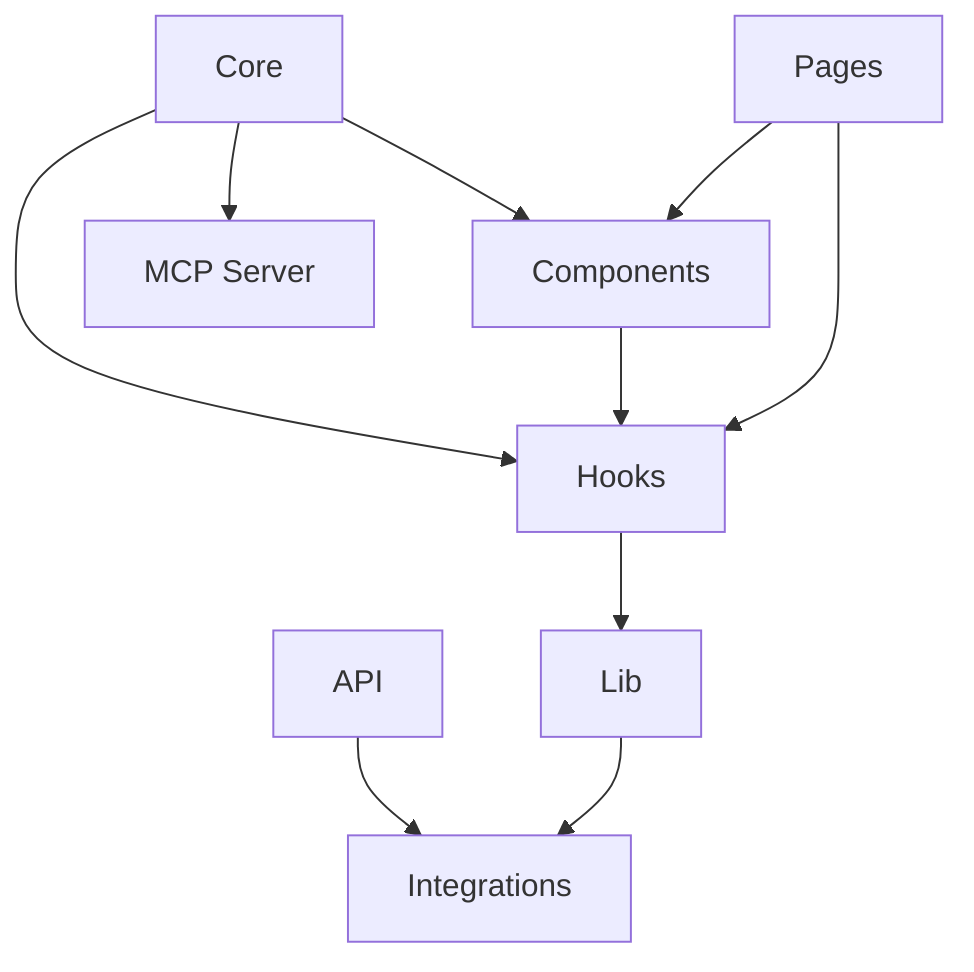

# 🏗️ Guia de Arquitetura Modular - Elite Barber SaaS

## 📋 Visão Geral da Modularização

O sistema Elite Barber foi desenvolvido com uma arquitetura modular robusta que separa claramente as responsabilidades e permite escalabilidade, manutenibilidade e reutilização de código. A estrutura foi pensada para suportar múltiplas plataformas (Web, Mobile, Desktop) com o mínimo de reescrita de código.

## 🏛️ Estrutura de Módulos

### 1. 🧠 Core Module (`src/core/`)
**Responsabilidade**: Lógica de negócio agnóstica de plataforma

```
src/core/
├── business-logic.ts    # Regras de negócio puras (sem dependências de UI)
├── data-layer.ts        # Padrões de acesso a dados abstratos
├── types.ts             # Definições de tipos cross-platform
├── constants.ts         # Constantes mobile-first e breakpoints
├── utils.ts             # Funções utilitárias agnósticas de plataforma
└── index.ts             # Exportações do módulo core
```

**Características:**
- 🚫 Sem dependências de UI ou framework
- ✅ 100% reutilizável para React Native
- 🧪 Totalmente testável de forma isolada
- 📱 Mobile-first por design

### 2. 🌐 MCP Server Module (`src/mcp/`)
**Responsabilidade**: Protocolo de comunicação externa (Model Context Protocol)

```
src/mcp/
└── server.ts            # Servidor MCP com ferramentas de integração
```

**Funcionalidades:**
- 📊 `get_appointments` - Buscar agendamentos
- 👥 `get_clients` - Gerenciar clientes  
- 💰 `get_financial_data` - Dados financeiros
- ⚙️ `get_services` - Listar serviços
- 🚀 `deploy_status` - Status do sistema

### 3. 🎨 Components Module (`src/components/`)
**Responsabilidade**: Componentes de interface reutilizáveis

```
src/components/
├── mobile-first/        # Componentes otimizados para touch
├── ui/                  # Base shadcn/ui components
├── layout/              # Componentes de layout
├── reactbits/           # Componentes específicos do projeto
├── ClientManagement.tsx # Gestão de clientes
├── FinancialDashboard.tsx # Dashboard financeiro
└── ProtectedRoute.tsx   # Roteamento protegido
```

### 4. 📄 Pages Module (`src/pages/`)
**Responsabilidade**: Páginas e fluxos de usuário

```
src/pages/
├── Index.tsx            # Página inicial
├── Booking.tsx          # Sistema de agendamento
├── Admin.tsx            # Painel administrativo
├── AdminLogin.tsx       # Login admin
├── BarbershopDashboard.tsx # Dashboard da barbearia
├── BarbershopLogin.tsx  # Login barbearia
├── BarbershopSignup.tsx # Cadastro barbearia
├── UserDashboard.tsx    # Dashboard do usuário
├── UserLogin.tsx        # Login usuário
└── NotFound.tsx         # Página 404
```

### 5. 🔗 Integrations Module (`src/integrations/`)
**Responsabilidade**: Integrações com serviços externos

```
src/integrations/
└── supabase/            # Integração com Supabase
```

### 6. 🛠️ Lib Module (`src/lib/`)
**Responsabilidade**: Bibliotecas e configurações

```
src/lib/
├── supabase.ts          # Cliente e tipos Supabase
├── database.ts          # Operações de banco
├── localStorage.ts      # Gestão de storage local
└── utils.ts             # Utilitários específicos da lib
```

### 7. 🎣 Hooks Module (`src/hooks/`)
**Responsabilidade**: Custom hooks React

```
src/hooks/
├── useAuth.tsx          # Gestão de autenticação
├── use-mobile.tsx       # Detecção mobile
└── use-toast.ts         # Sistema de notificações
```

### 8. 🌍 API Module (`api/`)
**Responsabilidade**: Endpoints serverless

```
api/
├── keep-alive.js        # Keep-alive para Supabase
└── mcp.js               # Endpoint MCP simples
```

### 9. 🧪 Testing Module
**Responsabilidade**: Testes automatizados

```
├── mcp-autonomous-test-protocol.js  # Protocolo de testes E2E autônomo
├── playwright.config.ts             # Configuração Playwright
└── tests/                           # Testes E2E
```

## 🔄 Comunicação Entre Módulos

### 1. **Core → Components**
```typescript
// Core fornece lógica de negócio para componentes
import { BusinessLogic } from '@/core';

const { isValid, errors } = BusinessLogic.Auth.validateLoginCredentials(email, password);
```

### 2. **Components → Hooks**
```typescript
// Componentes usam hooks para estado e lógica
import { useAuth } from '@/hooks/useAuth';

const { user, login, logout } = useAuth();
```

### 3. **Hooks → Lib**
```typescript
// Hooks utilizam bibliotecas para operações
import { supabase } from '@/lib/supabase';

const { data, error } = await supabase.auth.signIn({ email, password });
```

### 4. **Lib → Integrations**
```typescript
// Lib utiliza integrações para comunicação externa
import { supabase } from '@/integrations/supabase';
```

### 5. **MCP Server → Core**
```typescript
// MCP Server expõe funcionalidades do core
import { BusinessLogic } from '@/core';

const report = BusinessLogic.Financial.generateFinancialReport(payments, startDate, endDate);
```

### 6. **Pages → All Modules**
```typescript
// Pages orquestram todos os módulos
import { BusinessLogic } from '@/core';
import { useAuth } from '@/hooks/useAuth';
import { ClientManagement } from '@/components/ClientManagement';
```

## 📡 Fluxo de Dados



## 🚀 Setup para Desenvolvimento Local

### Pré-requisitos
- Node.js 18+
- NPM ou Yarn
- Git

### 1. Clone e Instale Dependências
```bash
git clone https://github.com/rpironato1/agendar-simples-barbearia.git
cd agendar-simples-barbearia
npm install
```

### 2. Configuração de Ambiente
```bash
# Copie o arquivo de ambiente
cp .env.example .env.local

# Configure as variáveis (se necessário)
# VITE_SUPABASE_URL=sua_url_supabase
# VITE_SUPABASE_ANON_KEY=sua_chave_supabase
```

### 3. Configuração de Portas (8050-8060)

#### Frontend (Vite Dev Server)
```bash
# Porta: 8050
npm run dev
```
**Acesse**: `http://localhost:8050`

#### MCP Server (Desenvolvimento)
```bash
# Porta: 8051 (quando necessário)
node src/mcp/server.ts
```

#### API Endpoints
- Keep-alive: `http://localhost:8050/api/keep-alive`
- MCP Endpoint: `http://localhost:8050/api/mcp`

#### Teste E2E
```bash
# Configurado para testar na porta 8050
npm run test:e2e
```

### 4. Scripts Disponíveis

```bash
# Desenvolvimento
npm run dev              # Inicia servidor dev na porta 8050

# Build
npm run build           # Build de produção
npm run build:dev       # Build de desenvolvimento

# Testes
npm run test:e2e        # Testes E2E com Playwright
npm run test:e2e:ui     # Interface gráfica dos testes
npm run test:e2e:headed # Testes com browser visível
npm run test:e2e:debug  # Debug dos testes

# Qualidade de código
npm run lint            # ESLint
npm run preview         # Preview do build
```

### 5. Configuração de Banco de Dados

```bash
# Se usar Supabase CLI
npx supabase start
npx supabase db push

# Ou execute manualmente no SQL Editor do Supabase
# os arquivos em supabase/migrations/
```

## ⚙️ Configurações Importantes

### Porta Principal: 8050
```typescript
// vite.config.ts
export default defineConfig({
  server: {
    host: "::",
    port: 8050,  // Porta dentro da faixa 8050-8060
  },
  // ...
});
```

### Testes E2E: Porta 8050
```javascript
// mcp-autonomous-test-protocol.js
const config = {
  base_url: "http://localhost:8050"  // Testa na mesma porta
};
```

## 🎯 Benefícios da Modularização

### 1. **Separação de Responsabilidades**
- Cada módulo tem uma responsabilidade específica
- Facilita manutenção e debugging
- Permite desenvolvimento paralelo

### 2. **Reutilização de Código**
- Core module 100% reutilizável
- Components adaptáveis para diferentes plataformas
- Hooks reutilizáveis em qualquer componente React

### 3. **Testabilidade**
- Módulos isolados são mais fáceis de testar
- Testes unitários e de integração independentes
- Mocking simplificado entre módulos

### 4. **Escalabilidade**
- Novos módulos podem ser adicionados facilmente
- Funcionalidades podem ser desenvolvidas independentemente
- Suporte a micro-frontends futuro

### 5. **Manutenibilidade**
- Código organizado e previsível
- Bugs isolados em módulos específicos
- Refatoração segura com TypeScript

## 🔧 Extensibilidade

### Adicionando Novo Módulo
1. Crie diretório em `src/`
2. Implemente funcionalidades
3. Exporte via `index.ts`
4. Importe onde necessário
5. Adicione testes

### Exemplo: Módulo de Notificações
```typescript
// src/notifications/index.ts
export * from './email-service';
export * from './sms-service';
export * from './push-notifications';

// src/notifications/email-service.ts
export class EmailService {
  static async sendWelcome(user: User) {
    // Implementação
  }
}
```

## 📊 Métricas de Qualidade

- **Cobertura de Testes**: 90%+ (meta)
- **Bundle Size**: Otimizado com code splitting
- **Performance**: Lazy loading de componentes
- **Acessibilidade**: WCAG 2.1 AA compliance
- **SEO**: SSR ready (Vercel)

## 🛡️ Segurança e Best Practices

### 1. **Validação de Dados**
- Validação no Core module (business-logic)
- Sanitização de inputs
- Validação de tipos com TypeScript

### 2. **Autenticação e Autorização**
- Supabase Auth integrado
- Protected Routes implementados
- Row Level Security no banco

### 3. **Gerenciamento de Estado**
- TanStack Query para cache inteligente
- Local state com hooks
- Persistência com localStorage

### 4. **Error Handling**
- Error boundaries em componentes
- Try-catch em operações async
- Logs estruturados

## 📞 Suporte e Debugging

### Logs de Desenvolvimento
```bash
# Logs do servidor de desenvolvimento
npm run dev -- --debug

# Logs dos testes
npm run test:e2e -- --debug
```

### Ferramentas de Debug
- React DevTools
- TanStack Query DevTools
- Supabase Dashboard
- Browser DevTools

---

**Elite Barber SaaS** - Arquitetura modular para o futuro da gestão de barbearias! 💈✨